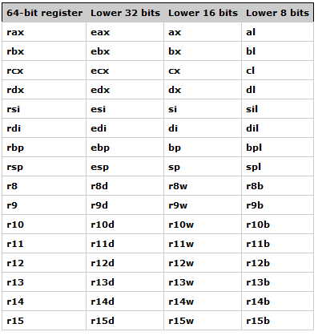

# libasm
Getting familiar with assembly language


## unknown stuff
* We can say that the assembly language does work with makefiles
* What the hell is Deepthough that is mentioned in the subject of the project?
* How do i write with a 64 bits ASM? (64 is the architecture of the machine) and what is the calling convention?
* What does doing inline ASM mean? and what are .s files?
* The code must be compiled with nasm (correct is the actual compiler of assembly when it doesn't work with C functions)
* What is the Intel syntax and what is the AT&T syntax that i can't use? (intel syntax is the most "modern" utilized since assembly changes  depending on the processors, AT&T was an old way of writing assembly)

Can it be that the 64 bit programming that got mentioned in the subject is related to the fact that with assembly we are working on cpu's and by consequence the cpu works with 64 bits registers? (yes)

I can use something called **mov** values or something to manipulate the memory

syscall can be used to make the computer do some operations when called, pratically the kernel it has defined codes to work out.

## Ok torniamo un attimo alla speculazione in italiano va

NASM è il compilatore per il linguaggio assembly per assemblare appunto il codice creando dei file oggetto i quali possono essere in seguito compilati per creare il file binario eseguibile.

## data transfer instructions
Facendo tanta pratica abbiamo imparato i vari metodi per manipolare i dati nei registri ci sono tre modi

```assembly
mov rdx, rsi ;;si copia il valore di rsi in rdx
mov rdx, 10 ;; mette il valore 10 all'interno del registro rdx
;;un po' particolare perché stiamo passando dati inerenti alla memoria qua
mov [rdx], rsi mette nell'indirizzo di rdx il valore di rsi
```
esistono diversi tipi di istruzioni di tipo **mov** e hanno i loro casi di utilizzo.
movsx --> serve per quando devi passare valori i quali hanno al loro interno dei segni (+/-)
movzx --> serve per quando devi passare dei valori da un registro più piccolo ad uno più grande in pratica inizializzerebbe i bit non utilizzati nel registro più grande a 0 per evitare buchi.


e invece l'istruzione **lea** (load effective address) come funziona? allora praticamente lea serve sempre per muovere dati tra i vari registri o tra le variabili dichiarate in .data per esempio, ma anziché muovere un valore effettivo come fa mov lea **prende l'indirizzo di quella variabile e la sposta nel registro apposito**.

è ottima nel caso si voglia creare un codice pulito seguendo le regole del PIC (position independent code) che dice di non toccare i valori nella sezione .data DIRETTAMENTE. Lea permette di prendere dati in maniera relativa al dato a cui ci riferiamo senza provare ad usufruire della sua posizione assoluta che porterebbe dare problemi di sicurezza assurdi. Sopratutto per una questione di portabilità è comodo perché grazie alla ricezione dei dati in maniera relativa il codice può essere eseguito da qualsiasi macchina visto che i dati dipendono dall'ofset del registro RIP e non da dove sono piazzati nella memoria.
RIP ha un ruolo fondamentale essendo che tiene l'indirizzo della prossima istruzione nel nostro programma ed è anche grazie a questo che riusciamo a ricavare degli indirizzi relativi visto che possiamo ricavarli indipendentente da dove ci troviamo nel programma

## rdi, rax, rsi
Starting from a cpu perspective we know that  it is made to perform basic operations for the computer.
So said operation may be, aritmetical, logical, input/output ones.
The problem is where is the data of so said actions stored? In the general purpose registers.
And some of this registers are actually the rdi, rax, and rsi registers that are present to the 64 bits architecture.
* rax -> handles the system call (syscall) number AND **update** stores the return results of the functions that are called VERY IMPORTANT
* rdi -> can be used to pass the **first argument** to a **function**
* rsi -> can be used to pass the **second argument** to a **function**
* rdx -> can be used to pass the **third argument** to a **function**


### small precautions
We are working with nasm now the old way of compiling that we utilized up there could be defined *wrong* in this case because of the subjects assignement on using nasm and i think that is more correct to use it in this case with assembly too. so yeah this way of compiling:
```bash
as asem.s -o asem.o
```
is actually wrong instead now to make the file "hello_world.asm" work we do:
```bash
nasm -f elf64 -o file.o file.asm
```
and this way we create the actual object file for the ld that when used by it, it will create the binary file/executable/input file

```bash
ld -o programName file.o
```
And to be more correct in my opinion you could do

```bash
gcc -o programName file.o
```

and that's it actually

## Torniamo alla speculazione (passare dati nelle funzioni):
assembly lavora con valori endian. la valutazione in endian determina l'ordine nel quale il computer legge i bytes in memoria piccolo fact.
Determina anche come viene letto un indirizzo di memoria in base alla sua endianess
* Little-endian:
Il byte meno significativo (quello "più basso") viene memorizzato all’indirizzo più basso.
Esempio: il valore 0x12345678 in memoria sarà memorizzato come 78 56 34 12 (dal byte all’indirizzo più basso a quello più alto).
È usato da CPU come x86, x86-64, ARM in modalità little-endian.

* Big-endian:
Il byte più significativo (quello "più alto") viene memorizzato all’indirizzo più basso.
Esempio: 0x12345678 sarà memorizzato come 12 34 56 78 in memoria.
È usato da alcune architetture come Motorola 68k, PowerPC (in modalità big-endian).

Nel nostro caso seguiamo le regole del little endian nella nostra architettura (86x64)

Allora cosa interessante nell'architettura 86x64 ci sono dei registri chiamati per essere sempre in quest'ordine i registri che passano dei valori all'interno di una funzione.

rdi - used to pass the first argument to a function.
rsi - used to pass the second argument to a function.
rdx - used to pass the third argument to a function.
r10 - used to pass the fourth argument to a function.
r8 - used to pass the fifth argument to a function.
r9 - used to pass the sixth argument to a function.
**rax** - gestisce il comportamento di syscall ed è anche il valore di ritorno

Ma questo si applica solamente con le funzioni chiamate tramite syscall che per quello che dobbiamo fare per questo progetto calza a pennello.

**important fact**
The ELF that we define in a type of file that are compatible with linux.

**What is db?**
DB - byte - 8 bits
DW - word - 2 bytes
DD - doubleword - 4 bytes
DQ - quadword - 8 bytes
DT - 10 bytes
DO - 16 bytes
DY - 32 bytes
DZ - 64 bytes

Cioè è come se dicessimo nel codice dove abbiamo utilizzato db che ogni singola lettera di quella parola equivale ad un byte, questo comporta che prepareremo la parola ad essere grande quanto la sua lunghezza definita grazie a db. Utilizziamo db per definire le nostre variabili invece per esempio essendo che gli interi sono definiti da 4 byte per definirili in maniera intelligente useremmo dd


## The stack
Praticamente sarebbe la sezione di memoria che verrebbe interpellata in caso finissimo i _general purpose registers_ uno stack lavora con il sistema LIFO per gestire il flusso di dati che gli vengono inseriti (push) e rimossi (pop).
Il suo funzionamento è in realtà molto basico. in parole povere serve quando non abbiamo i registri predefiniti per gestire i dati e di conseguenza pushiamo in modo "raw" i dati nello stack, ovviamente questo comporta che dovremmo riprenderceli uno ad uno in un ordine un po' bizzarro che corrisponderebbe all'ultimo numero che è stato inserito nello stack fino al primo segue appunto la struttura LIFO (last in first out)

Come ho menzionato implicitamente prima lo stack inserisce dei dati al suo interno con letteralmente le funzioni **push** e li rimuove con **pop**


_importante_
Lo stack cresce verso il basso non verso l'alto a livello figurativo, in più, più roba viene inserita più l'indirizzo è basso? non ho ben capito cosa si intende so solo che si parla del valore dell'address di quel valore inserito nello stack.
In realtà questo dettaglio è vitale per maneggiare i dati all'interno dello stack.
Infatti una cosa molto interessante è che lo stack può allocare al prprio interno della memoria appunto per poter salvare delle variabili e come fa? beh bisogna sotrarre al registro rsp il valore in bytes che vogliamo allocare ma di solito questa operazione è rara e viene utilizzata solamente per dati specifici, semplicimente fare push dovrebbe bastare la cosa importante da sapere è maneggiare il registro rbp che è fisso e ancorato a un determinato punto dello stack, spesso SE SAI la grandezza della variabile e calcoli l'offset da rbp **puoi anche reperire la variabile che ti serve senza sputarla fuori dallo stack**.

### How can you put stuff on a stack?
Questo dipende dal tipo di variabile che vuoi inserire al suo interno nel senso che per inserire dati devi sempre allocare qualcosa nello stack. Per fare in modo che però lo stack sia pronto a ricevere dati devi allocare = fare una sottrazione al puntatore rsp. questa sottrazione **DEVE** essere un multiplo di 16 (regola di ABI) altrimenti ci potrebbe essere il rischio di un segfault a causa di un disallineamento nella memoria.
Altra cosa veloce, di base rsp viene disallineato da rbp quando viene pushato all'inizio di una funzione quindi quando allochi, se vuoi farlo con una sola sottrazione devi tenere conto che quanto allochi dev'essere sommato a 8 e quella somma dev'essere un multiplo di 16.
Fino ad ora onestamente non ho avuto modo di sperimentare con questa storia dell'allineamento di rsp però molti codici che vengono disassemblati per essere letti in assembly fanno questa cosa quindi è comodo saperlo


## The functions
Allora le funzioni sono anch'esse un po' particolari. Praticamente la cosa principale è che ogni funzione lavora con due/tre _general purpose registers_

sono tre in particolare
**rip** - this register is the so-called instruction pointer. It stores the address of the next instruction the CPU is going to execute. When the CPU meets the call instruction to call a function, it pushes the address of the next instruction to run after the function call to the stack. This is done so the CPU knows where to continue the program's execution after the function call.

**rsp** - this register is called a stack pointer and should point to the top of the stack. After we push something to the stack using the push instruction, the stack pointer address decreases. After we pop something from the stack using the pop instruction, the stack pointer address increases.

**rbp** - this register is the so-called frame pointer or base pointer that points to the stack frame. As mentioned above, each function has its own stack frame, which is a memory area where the function stores local variables and other data.

allora questi tre elementi sono particolari e ci sono **SEMPRE** nelle funzioni create da noi in linguaggio assembly servono a manipolare uno stack che appunto si crea appositamente per le interazioni che avvengono in quella funzione specifica.

Allora l'idea generale di quei due registri è che rsp ha sempre accesso all'ultima variabile inserita nello stack quindi di per se è un registro dinamico perché è sempre in cambiamento.
E molto importante, vengono utilizzati all'interno delle funzioni perché di fatto il valore di ritorno all'interno delle suddette viene salvato nello stack.
Mi sono perso rip da qualche parte ma penso che tra i tre sia quello meno importante

praticamente è come se fosse una lista e rbp fosse **la testa** di questa lista, questo comporta che avremo sempre accesso alle variabili all'interno dello stack setuppando rbp all'inizio dello stack della funzione con un push
poi come accediamo alle variabili è un po' un'altra storia ancora in teoria servirebbe fare un piccolo calcolo con gli indirizzi per essere capaci di accedere ad ogni variabile all'interno dello stack partendo dalla base **cioè rbp**

<span style="color: red">
porco due mi sono dimenticato che quando lavoriamo coi registri è come se prima di utilizzare call per chiamare una funzione noi stessimo praticamente setuppando gli argomenti che passiamo appunto alla funzione dichiarata da noi, i registri sono gli <b>argomenti cazzzoooooooo</b>
</span>

### Perché pushare rbp nello stack all'inizio di una funzione?
L'operazione iniziale che viene spiegata dove rbp all'inizio quindi il *pushing* di rbp nello stack all'inizio di una funzione che viene chiamata è giustificato, praticamente serve a settare rbp per la funzione corrente essendo un registro "locale" viene usato anche prima in un'altra funzione di conseguenza ci salviamo nello stack il punto in cui rbp è arrivato questo comporta che possiamo poi inzializzarlo per utilizzarlo come base all'interno della nuova. In parole semplici è come se in C hai una funzione con le sue variabili dichiarate in essa alla fine della funzione quelle variabili non vengono salvate sono utilizzate solamente all'interno di quella funzione, stessa cosa qui solo che resettiamo lo stack per utilizzarlo come variabile locale della funzione

<span style="color: blue">
<b>ricorda!</b>
</span>

Essendo che aggiungere valori allo stack li fa andare in indirizzi più bassi per accedere ai registri precedenti l'offset dev'essere negativo sono identificabili come **variabili locali**.


### Gli offset di rbp
Allora se capisco questa cosa ho praticamente masterato le funzioni in assembly.
La domanda è come calcolo l'offset all'interno di rbp per metterci dentro una variabile?
forse questo l'ho finalmente capito. Praticamente l'offset è relativo alla variabile al suo interno, se parliamo di registri e quindi di puntatori sappiamo che l'offset per ogni puntatore è di 8 byte perché un puntatore è attualmente grande 8 byte.
per quanto riguarda l'offset di un intero per esempio sappiamo che esso è grande 4 e di conseguenza per riuscire a sapere come prendere il valore da rbp dobbiamo andare in fondo agli indirizzi per un moltiplicatore di 4


### Considerazioni sulle "funzioni" in assembly
Devo chiarire come si deve LE VERE funzioni vengono richiamate con l'istruzione call e per norma devono sempre avere la function prologue e epilogue perché lo stack dev'essere preparato esattamente per quella funzione, ed esse, vengono concluse dal ret il risultato della funzione poi viene salvato all'interno del registro **rax** sempre è proprio una regola assembly.
esempio della creazione della funzione "ft_strlen" che al suo interno utilizza delle apposite etichette

```assembly
;;remember rax saves the return value of the assembly function
;;CODDDUE

section .text
	global ft_strlen

ft_strlen:
	push rbp
	mov rbp, rsp
	xor r10, r10
.count_size:
	cmp byte [rdi], 0
	je .done
	inc r10
	inc rdi
	jmp .count_size
.done:
	mov rax, r10
	mov rsp, rbp
	pop rbp
	ret

```
Una cosa di cui puoi disporre all'interno del programma sono appunto le etichette. Queste fungono da sezioni all'interno del codice e fanno parte della funzione che viene chiamata finché stanno sotto di essa eccenzion fatta nel caso sotto la funzione ce ne sia un'altra che a sua volta può viene chiamata con call perché ho notato che questa differenziazione avviene appena il codice viene compilato, solo se si usa call quella etichetta è in realtà una funzione


## Debugging sheet
Qui mi segno qualche comando da utilizzare con gdb per capire meglio le operazioni fatte da assembly e non impazzire

Per iniziare dobbiamo compilare quando utilizzamo nasm con la flag -g alla fine perché se no eh so cazzi
quindi

```bash
nasm -f elf64 program.asm -o program.o -g

# di seguito creaimo l'eseguibile con ld

ld -o program program.o

#dopo che abbiamo il programma utilizziamo gdb per una questione personale io l'utilizzo così
gdb -tui -silent program
```
quando saremo in gdb ci sono dei comandi che all'interno di esso possiamo fare, essi sono molto utili secondo me

```bash
#comando che rimuove la parte di codice e la sostituisce con i registri e gli indirizzi di assembly
(gdb) lay asm
#rendo visibile la parte dei registri
(gdb) lay reg
#inizio il debugging
(gdb) start
#esploriamo il codice
(gdb) si
```

possiamo anche manipolare il contenuto dei registri in diretta per cambiare il risultato durante l'esecuzione del programma

```bash
(gdb) set $r10 = 10
```
per diciamo includere quel registro dobbiamo per forza utilizzare il $

```bash
#per vedere i breakpoints disponibili
(gdb) info break
```

**extra**
essendo che gdb lavora con i registri di base con la nomenclatura classica AT&M per cambiarlo ogni volta che viene utilizzato abbiamo fatto un .gdbinit dove abbiamo messo come default startup il comando per vedere con l'architettura intel
```bash
set disassembly-flavor intel
```
Possiamo anche fare dei comandi personalizzati volendo all'interno del .gdbinit file

**the x command** può anch'esso essere utilizzato all'interno del prompt di debug di gdb esso permette di visionare la memoria in diversi formati

* d --> decimali
* u --> unsigned int format
* x --> esadecimali
* t --> binario
* g --> Treat as 8 bytes (64 bits) per unit (g is often used for 64-bit formats)(non ho capito)

gli argomenti per specificare il formato vanno dopo la /
praticamente si scriverebbe così
```bash
(gdb)x/d &value
```

### le convezioni ABI (definizione di ABI si trova sotto)
1. come utilizzare lo stack (stack allignement)
   * Prima di ogni call lo stack pointer (rsp) dev'essere allineato per un multiplo di 16 byte
    * utile determinate istruzioni
    * un disallineamento di questo registro può potenzialmente causare segfaults
2. utilizzo dei registri
    * Registri volatili: caller-saved (modificabili dalle funzioni)
      * rax, rcx, rdx, rsi, rdi, r8-r11, xmm0-xmm15
    * Registri non volatili non chiamabili (vanno preservati)
      * rbx, rbp, r12-r15, rsp, rip
3. Passaggio dei parametri
     * Integer/pointer passati dai registri in quest'ordine
       * rdi, rsi, rdx, rcx, r8, r9
     * floating point values sono passati tramite xmm0-xmm7
     * argomenti aggiuntivi vengono passati dallo stack
4. valori di ritorno
  * integer/pointer returned in rax
  * floating-point returned in xmm0
  * large structs returned into an hidden poiter in rdi

#### Perché l'allineamento dello stack è importante
* rischi un crash o un segfault se rsp non è allineato

## Sections
utilized to give instruction to the program, they are mostly used to do different things like for example basic variable declaration or to actually tell to the computer where the program is gonna start.
some basic sections are the following

* data - used for declaring initialized data or constants.
* bss - used for declaring non-initialized variables.
* text - used for the code of the program.
* shstrtab - stores references to the existing sections.

## Arithmetic calculations:
Basic list of arithmetic instructions used in assembly
* ADD - Addition it does the operation on the first two operands that are written after it
* SUB - Subtraction it does the operation on the first two operands that are written after it
* MUL - Unsigned multiplication the result of the operation is stored on the rax and rdx registers
* IMUL - Signed multiplication the result of the operation is stored on the rax and rdx registers
* DIV - Unsigned division the result of the operation is stored on the rax and rdx registers depending on the amount of bit involved it changes the storer of the result
* IDIV - Signed division the result of the operation is stored on the rax and rdx registers
* INC - Increment by one the defined value
* DEC - Decrement by one the defined value
* NEG - Negation

Very simple and chill to use it seems. I'll try to have one file for this kind of exercise though.

### Clarification for multiplications and divisions
la moltiplicazione è molto semplice, in parole povere ogni qualvolta che facciampo l'istruzione MUL il valore che viene passato a MUL verrà sempre moltiplicato per il valore presente nel registro RAX.

La divisione d'altro canto ha qualcosa di diverso. Una cosa che ho avuto modo di sperimentare nei giorni precedenti con il codice era il comportamento della divisione. In pratica l'istruzione DIV salva due valori in due registri predefiniti dove RAX si salva il risultato della divisione semplice, invece RDX si salva il resto della divisione. Interessante.
RAX --> quoziente
RDX --> resto

## control flow
To put it simply is to handle the if elses statement like in the C language.

First of all we use the *cmp* directive to compare the registers with the given value.
BUT! It can't work by itself because it does the check but it doens't say what to do after, for the result of the control flow statement we need to use other directives.
Example of cmp usage
```assembly
;; Compare the value of the rax register with 50
cmp rax, 50
```


For handling the "results" we have the **conditional jumps instructions:**
* JE - Jump if the values are equal.
* JNE - Jump if the values are not equal.
* JZ and jnz jump if the previous comparison operation set zero flag to 1 or 0 (for more info check the Control transfer instructions part it deeper in this doc)
* JG - Jump if the first value is greater than the second.
* JGE - Jump if the first value is greater or equal to the second.
* JA - The same as JG, but performs the unsigned comparison.
* JAE - The same as JGE, but performs the unsigned comparison.
* JL - jump if the first value is smaller than the second
* jo used in case a register goes in overflow (didn't work well last time though)
* jge and jle - Jump if the previous comparison operation resulted that one operand is greater (or equal) or smaller (or equal) than another.


In fact we have this C code
```c
if (rax != 50) {
    foo();
} else {
    bar();
}
```
that becomes
```assembly
;; Compare rax with 50
cmp rax, 50
;; Jump to the label `.foo` if the value of the `rax` register is not equal to 50
jne .foo
;; Jump to the label `.bar` otherwise
jmp .bar
```

## Other stuff concerning the stack in assembly
Allora, abbiamo scoperto più o meno in generale come funziona lo stack.
Sappiamo che per esempio con **push** inseriamo dati al suo interno con degli indirizzi bassi e con **pop** sputiamo fuori l'ultimo valore che è stato inserito (LIFO).

Teniamo anche conto di **call** e **ret** però, dove call chiama la procedura richiesta salvando come indirizzo di ritorno delle istruzioni nello stack. **ret** invece, esce dalla procedura data, modifica lo stack rimuovendo l'indirizzo di ritorno e trasferendo nuovamente il "flow" di esecuzione prima di **call**

### more about control flow (jmp and call)
Un'altra cosa che ho avuto modo di scoprire adesso è che la grande differenza di usare l'istruzione **call** al posto di **jmp** è che in parole povere call lo si utilizza per andare da una parte del codice sapendo che quella parte lì possiede l'indirizzo del chiamante nello stack, di conseguenza quando useremo ret alla fine della funzione o "etichetta" se dobbiamo essere precisi, ritorneremo al punto dove la funzione è stata chiamata. invece con jmp non teniamo conto di chi ha chiamato la funzione perché logicamente si vede che vogliamo andare ad un punto preciso del codice e andare avanti da lì senza tornare indietro a meno non usiamo jmp di nuovo in una etichetta che anticipa quella sezione di codice che ha chiamato.

**AGGIORNAMENTO**
Una cosa da considerare, ogni cosa che viene triggerata con CALL può essere definita una funzione **indipendente** invece il resto può essere chiamato etichetta e queste avvengono SEMPRE in una funzione le funzioni devono sempre avere ciò che viene chiamato function prologue e epilogue che sono una procedura per avere lo stack disponibile per le variabili locali di quella funzione, che se ci pensi è come le variabili all'interno di una funzione, esse sono create la e muoiono la l'unica cosa che porti fuori da una funzione è il return, ci sono eccezioni quali il cambiamento di determinati dati nella funzione tramite indirizzo ma per questo progetto non viene approfondità come cosa

## Logical instructions
Used to perform logical operations.
AND - entrambi le casistiche devono essere vere per rendere vero questa istruzione
OR - basta che una delle due casistiche sia vere per essere anch'esso verò
XOR - funziona solo se uno delle due casistiche è vero se no da sempre falso
NOR - entrambe le casistche devono essere false per fare in modo che questa istruzione sia vera


## cld and the flags reset

Ok ho capito in parole povere ma neanche troppo, **cld** definisce come le stringhe vengono processate quando vengono fatte delle operazioni su di esse cambiando il valore del **df** (direction flag). Esempio stupido, se devo passare una stringa scritta come 'ABC' a un'altro registro con df = 0 la passo praticamente come l'ho scritta se invece df = 1 la passo al contrario e cioè 'CBA', movsb

## Flags and checker registers
This part is about the flags that gets triggered when the cmp instruction is used
* zf --> zero flag set if the operands are equal to eachother
* cf --> carry flag set when the result of an arithmetic instruction is too big to be stored in the place is going to be stored
* sf --> sign flag Set if the result of an arithmetic instruction produced a value in which the most significant bit is set. praticamente determina in base alla composizione del valore se è un numero negativo (ci sono più 1 nel numero binario) o positivo (ci sono più zeri nel numero binario)
* dl --> direction flag set when we want to flow strigns from the highest address to the lower ones

## Strings behaviour
Allora cosa abbiamo uisato con le stringhe nella lezione?
lodsb non so bene a cosa serva, è direttamente collegato al registro rsi. praticamente prende il byte presente in rsi e lo carica sul registro al (in questo caso perché stiamo utilizzando lodsb), esiste una vera e propria categoria per i lods ah e **ogni volta che utilizziamo lodsb esso INCREMENTERÀ automaticamente il puntatore di rsi**
abbiamo scorso la nostra stringa un byte alla volta grazie al controllo per il contenuto del registro con le []
esempio
```assembly
;; check che la stringa non sia stata conclusa
cmp [rsi] byte 0
;; dopo essermi assicurato che la lettera che devo prendere nell'intera stringa sia valida
;; posso salvarla nel registro rax (al) grazie a lods
lodsb
```

## Interesting stuff for this and future projects
PIC (position independent code) un acronimo per definire il modo nel quale le istruzioni della macchina vengono eseguiti. Nel senso che essi verranno compilati ed eseguiti indipendentemente dal loro INDIRIZZO DI MEMORIA. Allora nel contesto di assembly può essere usato in vari modi per migliorare e rendere più portabile il codice scritto.
Serve sopratutto quando si usano librerie esterne visto che non sappiamo esattamente l'address di suddetta funzione dobbiamo affidarci a qualcosa per sapere la loro posizione relativa al nostro codice, questo accade grazie alla procedure linkage table (PLT in breve) esso va a stanare per noi l'address di memoria della funzione di cui vogliamo usufruire. infatti quando vogliamo utilizzare una funzione esterna già esistente utilizzamo l'acronimo plt per dire che la stiamo prendendo da un indirizzo relativo

## Studies todo

- [x] what is the definition of linker?
  A linker or link editor is a computer program that combines intermediate software build files such as object and library files into a single executable file such a program or library.
  Pratically we are using ld to make the object created by nasm into an executable it links together the object file to a program
- [x] understanding the mechanics of the functions made by yourself in the assembly language
- [x] fare un printer in assembly is it possible??? (extra)
- [x] creating ft_strlen, it's pratically a test to see if you finally have a grasp of the function creation thing
- [ ] Scoprire se è possibile collegare più files tra di loro in assembly e all'occorrenza snellire i file senza avere tutte le funzioni in un unico posto

# Avaible "built in" registers


# extra
- Max int for 64bit registers: 9,223,372,036,854,775,807
After that it overflows, overflow meaning is that the value from a positive integer it becomes a negative one and viceversa this is a good criteria to check overflows.
🗿
- In case you would work with arguments given by terminal those are stored in the stack, just know that in order you will receive the number of arguments before the arguments.
-The ABI requirement: Application Binary Interface -> sono delle regole per definire come il codice interagisce con i componenti macchina è una serie di convenzioni per come fare chiamate a funzioni, utilizzo di registri, management dello stack, data allignment.

# Little planning on what to do next:
* finish the asm guide on github
* then seeing if the knowledge that i got i'm able to do libasm (if not this task goes under the next one)
* studying nasm
* understanding how to use multiple files for an assembly project

# resources
A very good starting point to learn the language
https://github.com/0xAX/asm

Another guide that even touches the advantages of using assembly for cybersecurity
https://guyinatuxedo.github.io/index.html

One of the most useful ones for beginners (it's made by the people that made the compiler for assembly)
https://cs.lmu.edu/~ray/notes/nasmtutorial/


# Cosa fare la prossima volta (per ricordarmi se no divento pazzo)🗿
